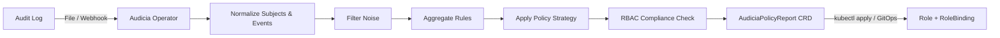

# Audicia

**Automated RBAC policy generation for Kubernetes.** Audicia is a Kubernetes Operator that watches audit logs, learns
what your workloads actually do, and generates least-privilege Roles — so you never have to write RBAC by hand again.

```
403 Forbidden → Audit Event → Audicia → Role + RoleBinding → 200 OK
```

## The Problem

Every Kubernetes cluster has over-permissioned service accounts. Teams bind `cluster-admin` because writing correct RBAC
is too hard. Audicia fixes this by observing actual API access patterns and generating the minimal policy that satisfies
them.

## Goals

- **Generate correct, minimal RBAC policies** from observed runtime behavior in audit logs.
- **Run continuously** as a Kubernetes Operator with checkpoint/resume — not a one-shot script.
- **Produce GitOps-ready output** as Kubernetes CRDs that integrate with ArgoCD, Flux, and standard tooling.
- **Give operators control** over policy strictness via configurable strategy knobs.
- **Detect RBAC drift** by comparing observed usage against effective permissions — flag overprivilege with
  Green/Yellow/Red compliance scoring.

## Non-Goals

- **Audicia does not apply policies.** It generates `AudiciaPolicyReport` CRDs. A human or reviewed GitOps pipeline
  applies them. Automated privilege escalation is a security anti-pattern.
- **Audicia does not enforce policies.** That is the domain of OPA/Gatekeeper. Audicia generates policy; enforcers
  enforce it.
- **Audicia does not require Secrets access, Impersonation, or cluster-admin.** It reads audit logs, reads RBAC
  bindings/roles (for compliance scoring), and writes CRDs. Nothing more.
- **Audicia does not replace static scanning.** Tools like Trivy scan YAML at rest. Audicia analyzes runtime behavior.
  Use both.

## How It Works



1. **Point Audicia at your audit log** — Create an `AudiciaSource` CR.
2. **Audicia observes access patterns** — It processes both allowed and denied requests, normalizes subjects, handles
   subresources, and migrates deprecated API groups.
3. **Audicia generates a policy report** — An `AudiciaPolicyReport` CR with structured observations in `.status` and
   ready-to-apply YAML manifests.
4. **Audicia evaluates compliance** — It resolves the subject's current RBAC bindings and compares them against observed
   usage, producing a compliance score (Green/Yellow/Red) that shows how overprivileged the subject is.
5. **Review and apply** — Use `kubectl apply`, GitOps (ArgoCD/Flux), or the upcoming dashboard.

## Quick Start

```bash
# Install the operator from the local Helm chart
helm install audicia ./deploy/helm -n audicia-system --create-namespace

# Point it at your audit log (see docs/examples/ for manifests)
kubectl apply -f audicia-source.yaml

# Check generated reports
kubectl get audiciapolicyreports --all-namespaces
```

> **Local development:** Use `make kind-cluster` to create a cluster with audit logging, then `make helm-install` to
> install from the local chart. See [CONTRIBUTING.md](CONTRIBUTING.md) for the full setup.

> **Note:** Audit logging must be enabled on your kube-apiserver. See the
> [Getting Started guide](docs/getting-started/installation.md) or the
> [Demo Walkthrough](docs/guides/demo-walkthrough.md#step-0-enable-audit-logging) for setup recipes.

## Example Output

Audicia observes that `backend` service account in `my-team` namespace calls `GET pods` and `POST pods/exec`, and
generates:

```yaml
apiVersion: rbac.authorization.k8s.io/v1
kind: Role
metadata:
  name: suggested-backend-role
  namespace: my-team
rules:
  - apiGroups: [ "" ]
    resources: [ "pods", "pods/exec" ]
    verbs: [ "create", "get" ]
```

No more guessing. No more `cluster-admin`. Just the permissions your workloads actually need.

### Compliance Output

If the `backend` SA currently has a broad Role granting access to secrets, configmaps, and more, Audicia detects the
drift:

```
$ kubectl get apreport -n my-team
NAME              SUBJECT   KIND             COMPLIANCE   AGE
report-backend    backend   ServiceAccount   Red          5m
```

```yaml
status:
  compliance:
    score: 25
    severity: Red
    usedCount: 2
    excessCount: 6
    sensitiveExcess:
      - secrets
```

This tells you: the SA only uses 2 of its 8 granted permissions, and has unused access to secrets.

## Configuration

Audicia gives you control over policy generation with strategy knobs:

| Knob        | Options                                  | Default           | Description                                         |
|-------------|------------------------------------------|-------------------|-----------------------------------------------------|
| `scopeMode` | `NamespaceStrict`, `ClusterScopeAllowed` | `NamespaceStrict` | Generate Roles or also allow ClusterRoles           |
| `verbMerge` | `Smart`, `Exact`                         | `Smart`           | Merge read-like verbs or keep exact                 |
| `wildcards` | `Forbidden`, `Safe`                      | `Forbidden`       | Never generate `*` or allow when all verbs observed |

See [docs/examples/](docs/examples/) for full configuration samples.

### Filter Evaluation

Filters are evaluated as an ordered allow/deny chain. **First match wins.** If no rule matches, the event is allowed by
default.

```yaml
filters:
  # 1. Block all node-related noise first
  - action: Deny
    userPattern: "^system:node:.*"
  # 2. Block control plane internals
  - action: Deny
    userPattern: "^system:kube-.*"
  # 3. Only process events from specific namespaces
  - action: Allow
    namespacePattern: "^(production|staging)-.*"
  # 4. Deny everything else (explicit deny-all at the end)
  - action: Deny
    userPattern: ".*"
```

Common recipes:

- **Block system noise only:** Two `Deny` rules for `system:node:*` and `system:kube-*`. Everything else flows through.
- **Namespace allowlist:** `Deny` system noise, then `Allow` specific namespace patterns, then `Deny .*` at the end.
- **Single-team focus:** `Deny` all system users, `Allow` one namespace, `Deny` everything else.

## Documentation

| Section                                                 | Description                                                |
|---------------------------------------------------------|------------------------------------------------------------|
| [Getting Started](docs/getting-started/introduction.md) | Introduction, installation, and quick start tutorials      |
| [Architecture](docs/concepts/architecture.md)           | System design, data flow diagrams, component breakdown     |
| [Webhook Setup](docs/guides/webhook-setup.md)           | Real-time webhook ingestion with TLS/mTLS                  |
| [Feature Reference](docs/reference/features.md)         | Complete feature list and configuration options            |
| [Comparisons](docs/comparisons.md)                      | Feature comparison with audit2rbac, Trivy, OPA, and others |
| [Roadmap](docs/roadmap.md)                              | What's done, in progress, and planned                      |
| [Demo Walkthrough](docs/guides/demo-walkthrough.md)     | Step-by-step walkthrough of the Audicia workflow           |

## Project Status

Audicia's core is complete: the v1alpha1 CRDs, full ingestion pipeline (file + webhook), policy generation engine,
and RBAC compliance scoring are all implemented and tested in production. See the [Roadmap](docs/roadmap.md) for
what's next.

## Contributing

We welcome contributions. See [CONTRIBUTING.md](CONTRIBUTING.md) for development setup and guidelines.

## Security

For vulnerability reports, see [SECURITY.md](SECURITY.md). Do not open public issues for security vulnerabilities.

## License

Apache License 2.0. See [LICENSE](LICENSE).
